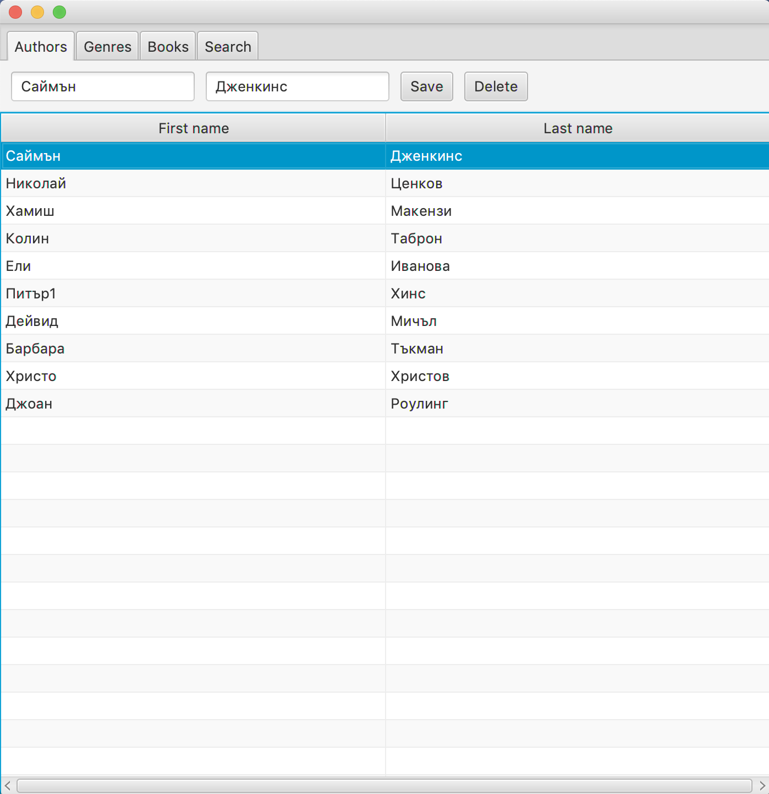
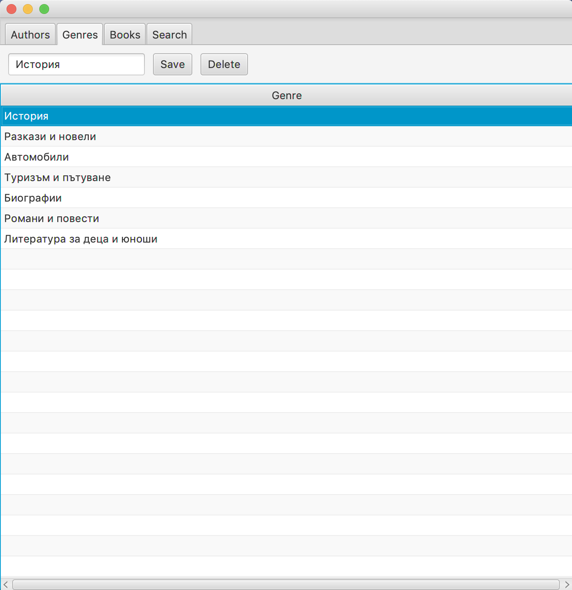
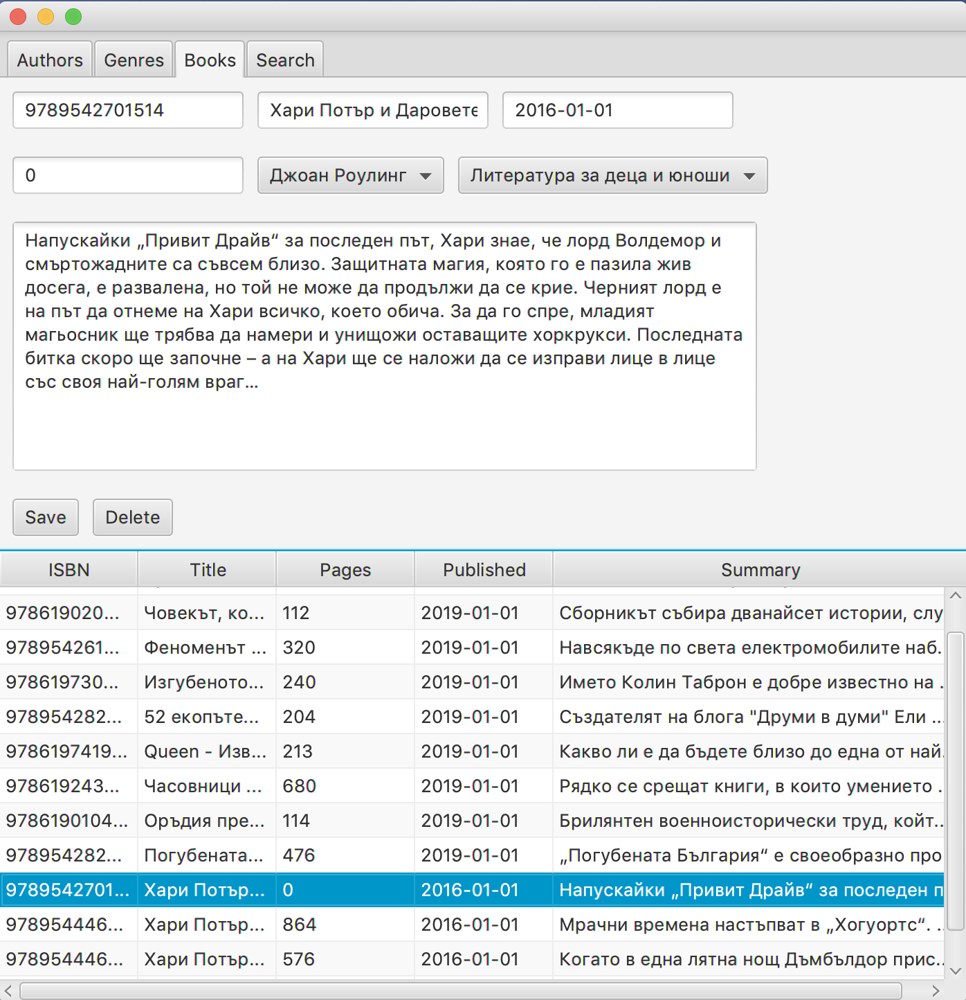
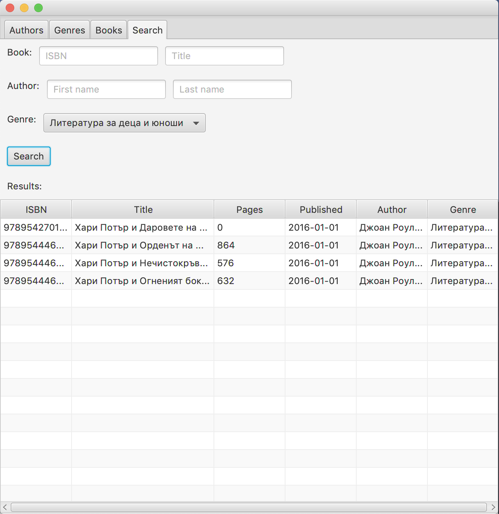

## Book Management System

### Overview

Simple project for managing books in a library.

### Database

Start the database locally with:

```
java -jar ./drivers/h2-1.3.175.jar -baseDir ./data/h2dbs
```

### Used technologies

- JavaFx
- Java 8
- H2 database

### Screenshots

<p>
  
</p>

<p>
  
</p>

<p>
  
</p>

<p>
  
</p>
